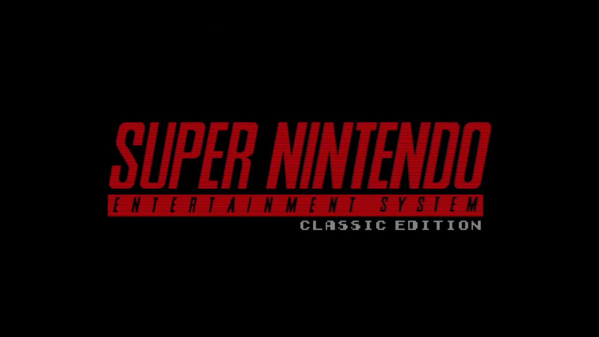

# Hakchi Classic Splash

I just put together a demo intro by [Viral_DNA](https://www.youtube.com/watch?v=uQEgmImThDk) with the work by
[TheOtherGuys](https://www.reddit.com/r/miniSNESmods/comments/80bgar/hakchi_boot_screen_mod_now_with_audio/) to provide a classic boot splash for the miniSNES that includes the memory fixes by the latter.

Since I already spent the time putting this together with resources available
online, I just wanted to make it available for everyone.

It's a small video that fades in from black into the following image:

## Credits
- [TheOtherGuys](https://www.reddit.com/r/miniSNESmods/wiki/theotherguys): Hakchi Boot Screen Mod creators. Make sure to check their other projects: https://github.com/TheOtherGuys-Hakchi-Projects
- [Viral_DNA](https://www.reddit.com/r/miniSNESmods/comments/7u9pms/worlds_first_animated_boot_mod_for_nintendo/): Custom classic intro creator. 